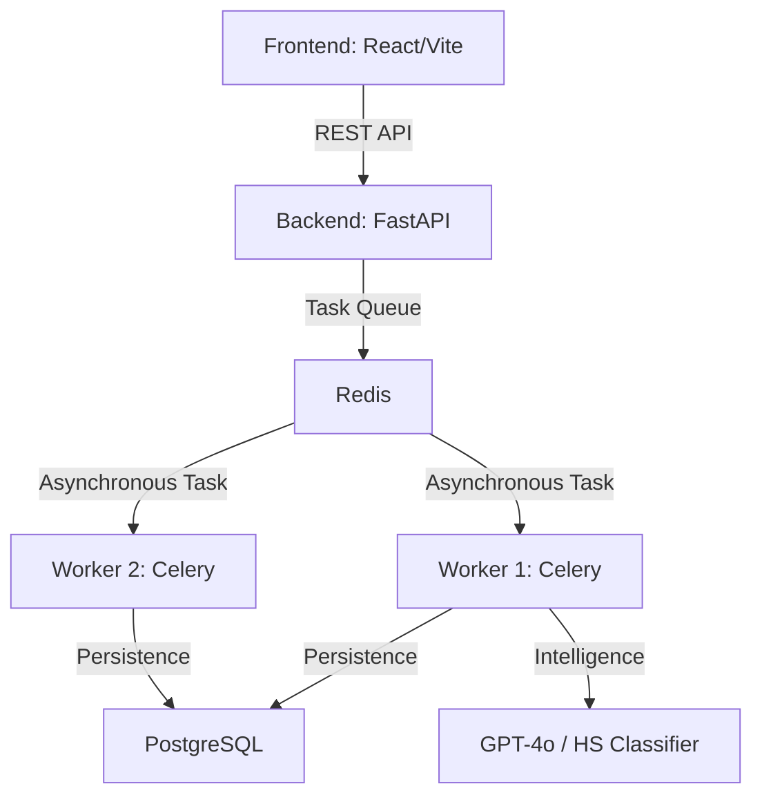
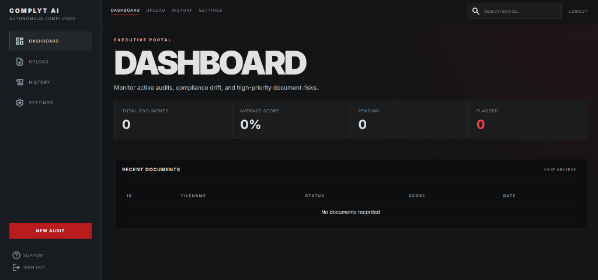
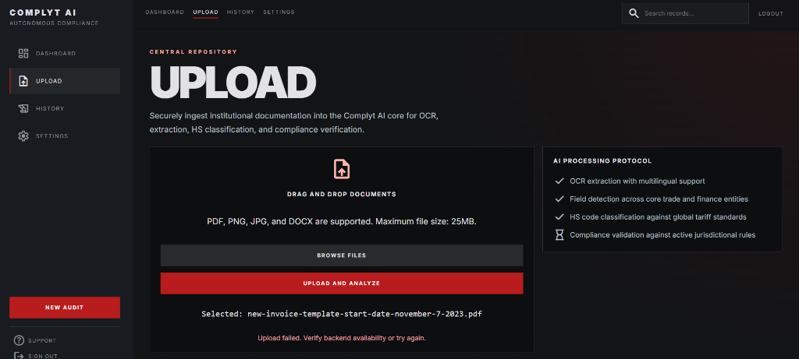
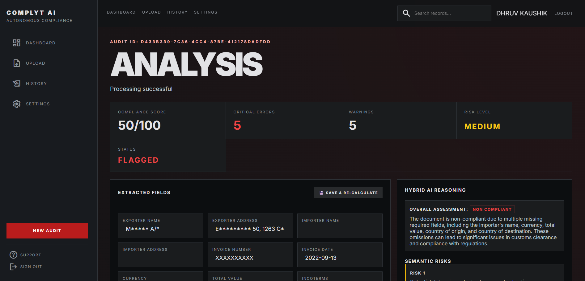
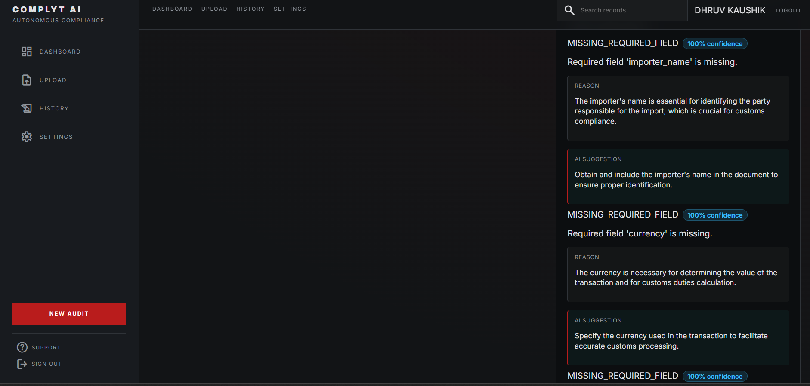
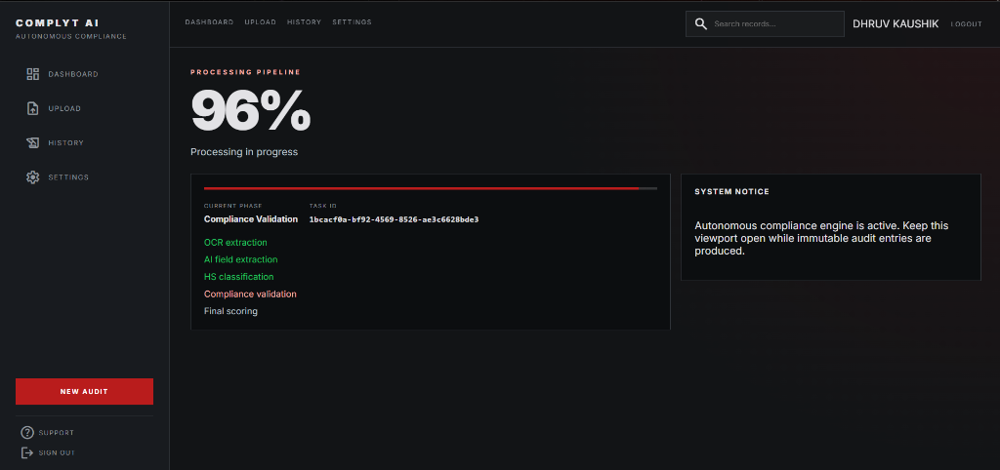

# Complyt

AI-powered autonomous compliance system for international trade — transforming raw logistics documents into structured, validated, and auditable data with real-time risk assessment.

[](https://opensource.org/licenses/MIT)
[](https://fastapi.tiangolo.com/)
[](https://reactjs.org/)
[](https://www.docker.com/)

## 🔴 Problem Statement

International trade compliance is complex, error-prone, and manual.

- **Inconsistent Documentation**: Invoices and bills of lading vary wildly in format.
- **High Stakes**: Small errors lead to shipment delays, penalties, and massive financial loss.
- **Opaque Verification**: Compliance verification is slow and lacks transparency.
- **Manual Bottlenecks**: Businesses rely on rigid rule-based systems that fail in real-world scenarios.

## 🟢 Solution

**Complyt** is an AI-powered compliance engine that automates document processing, validation, and decision-making.

It combines:
- **Intelligent OCR** for high-fidelity document ingestion.
- **LLM Synthesis**: GPT-4o powered structured field extraction.
- **Hybrid Engine**: Deterministic rules combined with semantic AI reasoning.
- **Fault-Tolerant Architecture**: Distributed processing with Celery and Redis.

## 🔥 Key Features

### 🧠 Hybrid Compliance Engine
Deterministic rules detect issues while AI provides reasoning and suggestions.

### 🔁 Idempotent & Fault-Tolerant Processing
Ensures no duplicate processing even under concurrent requests using deterministic file hashing.

### ⚙️ Distributed Architecture
Built with Celery workers for massive horizontal scalability.

### 📊 Compliance Scoring System
Provides instant decision signals:
- ✅ **COMPLIANT** (Score ≥ 70)
- ⚠️ **AT RISK** (Score 40-70)
- ❌ **NON-COMPLIANT** (Score < 40)

### 🚨 Top Issue Prioritization
Highlights the most critical compliance risks for faster decision-making.

### 🔍 End-to-End Traceability
Processing timelines show exactly when OCR, AI extraction, and validation finished.

## 🧱 Architecture



The system uses asynchronous task processing with distributed workers, ensuring scalability and reliability even during high-volume document ingest.

## ⚙️ Tech Stack

- **Frontend**: React (Vite), TypeScript, Tailwind Styling.
- **Backend**: FastAPI, SQLAlchemy (Postgres), Redis, Celery.
- **AI Layer**: GPT-4o, Custom HS Code Classifier.
- **Infrastructure**: Docker Compose, Kubernetes (Minikube).
- **Observability**: Loki, Grafana (Centralized Log Aggregation).

## 🧪 How It Works (Flow)

1. **Ingest**: User uploads logistics documents (PDFs, Images).
2. **Idempotency**: System generates a unique key to prevent duplicate processing.
3. **Queue**: Documents are queued asynchronously via Celery.
4. **OCR**: Raw text extraction from unstructured files.
5. **AI Extraction**: LLM parses text into 20+ structured trade entities.
6. **Validation**: Rule-based engine checks for missing fields and threshold violations.
7. **Reasoning**: AI explains complex issues and provides actionable suggestions.
8. **Audit**: System generates a final compliance score and risk assessment.

## 📸 Screenshots

### Executive Dashboard

*Monitor active audits, compliance drift, and high-priority document risks.*

### Upload Interface

*Secure document ingestion with multi-format support.*

### Deep Compliance Analysis

*Real-time scoring and error detection overview.*

### AI Reasoning & Suggestions

*Actionable insights and semantic reasoning for compliance gaps.*

### Processing Pipeline Trace

*Full traceability of the processing pipeline.*

## 🚀 How to Run

### Using Docker Compose (Recommended)
```bash
docker-compose up --build
```

### Using Kubernetes
```bash
minikube start
kubectl apply -f k8s/
```

## 🧠 What Makes Complyt Different?

- **Hybrid Intelligence**: Combines rigid rule-based systems with flexible AI reasoning.
- **Production-Ready**: Handles real-world concurrency using idempotent design.
- **Explainable Decisions**: Doesn't just say "No", it explains *why* and tells you *how* to fix it.
- **Enterprise Architecture**: Built on a distributed task queue designed for heavy loads.

## 🔮 Future Scope

- **Pre-shipment Risk Prediction**: Anticipate customs delays before they happen.
- **Sanctions Screening**: Integrate denied party and sanctions list monitoring.
- **Regulatory Monitoring**: Automatic updates to rulesets based on jurisdictional changes.
